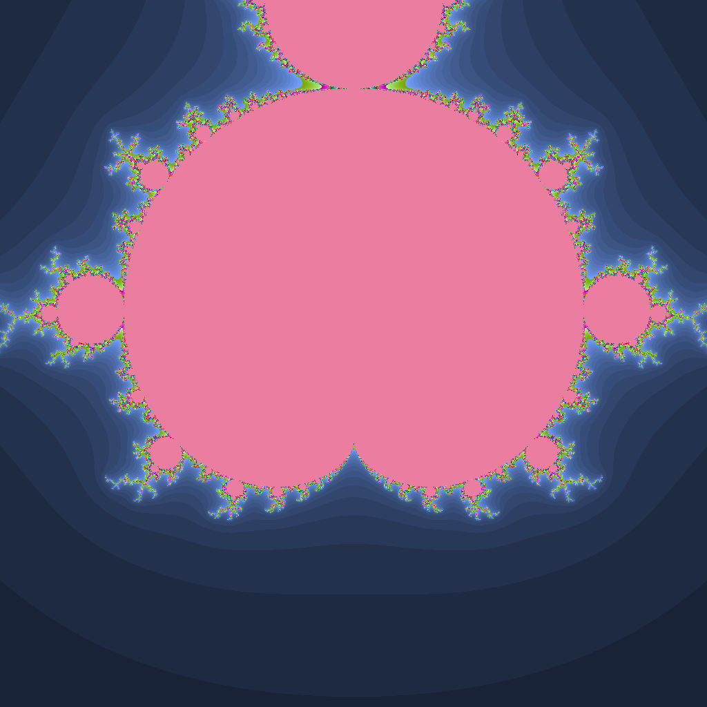

# Mandelbrot Fractal Generator

This project generates a Mandelbrot fractal image using Java. It was created as part of an educational exercise to gain experience with the Java programming language.

## Project Structure

The project consists of the following main classes:

- **`Complexe`**: A class for handling complex numbers, including operations like addition and multiplication.
- **`Image`**: A class for managing image creation and manipulation.
- **`ImageToolkit`**: A utility class for additional image processing functions.
- **`Mandel`**: The main class that generates the Mandelbrot fractal by iterating over complex numbers and storing the results in an image.

## Dependencies

This project does not require external dependencies beyond standard Java libraries.

## Usage

1. Compile the Java files:
   ```sh
   javac TestMandel.java
   ```
2. Run the Mandelbrot generator:
   ```sh
   java TestMandel
   ```
3. The generated fractal image will be saved as `Mandel.png` in the current directory.

## Results

Below is an example of the generated Mandelbrot fractal:



## Purpose

This project was developed as part of an academic curriculum to practice Java programming, object-oriented design, and image processing.


